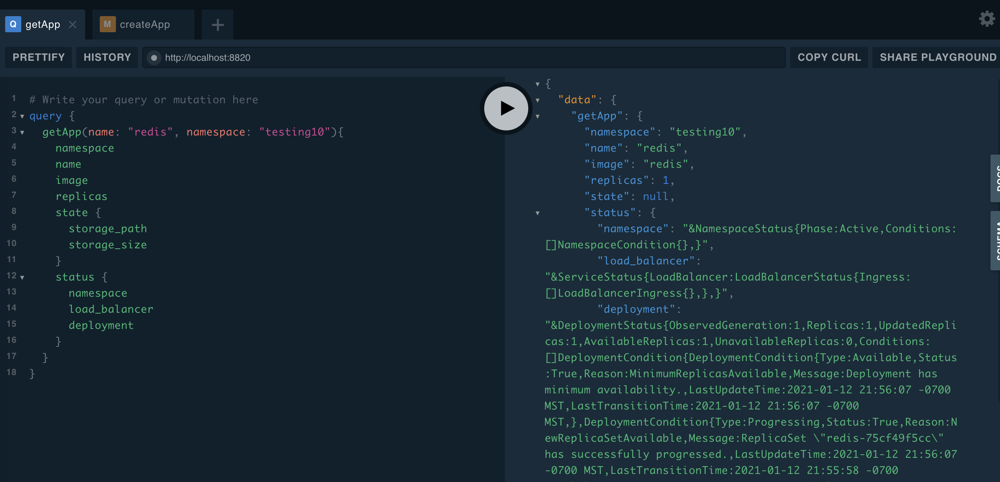

# meshpaas




an opinionated, OAuth-protected graphQL/gRPC API for easily deploying applications & jobs on Istio service mesh

[graphQL Documentation](https://autom8ter.github.io/meshpaas/)

## Features

- [x] [gRPC API](schema.proto)
    - [x] golang client sdk[](https://godoc.org/github.com/autom8ter/meshpaas/meshpaas-client-go)
    - [x] [javascript client sdk](gen/grpc/js)
    - [x] [java client sdk](gen/grpc/java)
    - [x] [php client sdk](gen/grpc/php)
    - [x] [python client sdk](gen/grpc/python)
    - [x] [ruby client sdk](gen/grpc/ruby)
    - [x] [csharp client sdk](gen/grpc/csharp)
- [x] [graphQL API](schema.graphql)
    - served on `/graphql` endpoint
- [x] graphQL playground(autocomplete/schema-documentation/query-console)
    - playground served on `/`
- [x] Run in cluster
- [x] Run out of cluster
- [x] OpenID Connect based Authentication
- [x] Create Application
- [x] Update Application
- [x] Get Application
- [x] Destroy Application
- [x] List Applications
- [x] Stream Application Logs
- [x] Expression based Application "authorizers"(execute against open-id profile)
- [x] Create Task
- [x] Update Task
- [x] Get Task
- [x] Destroy Task
- [x] List Tasks
- [x] Create Gateway
- [x] Update Gateway
- [x] Get Gateway
- [x] Destroy Gateway
- [x] List Gateways
- [x] Create Secret
- [x] Update Secret
- [x] Get Secret
- [x] Destroy Secret
- [x] List Secrets

## Command Line

```
Usage of meshpaas:
      --allow-headers strings         cors allow headers (env: KDEPLOY_ALLOW_HEADERS) (default [*])
      --allow-methods strings         cors allow methods (env: KDEPLOY_ALLOW_METHODS) (default [HEAD,GET,POST,PUT,PATCH,DELETE])
      --allow-origins strings         cors allow origins (env: KDEPLOY_ALLOW_ORIGINS) (default [*])
      --debug                         enable debug logs (env: KDEPLOY_DEBUG) (default true)
      --listen-port int               serve gRPC & graphQL on this port (env: KDEPLOY_LISTEN_PORT) (default 8820)
      --out-of-cluster                enable out of cluster k8s config discovery (env: KDEPLOY_OUT_OF_CLUSTER)
```

## Installation

Given a running Kubernetes cluster, run:

```yaml
curl https://raw.githubusercontent.com/autom8ter/meshpaas/master/k8s.yaml >> k8s.yaml
```

inspect the manifest and add/adjust environmental variables in the deployment spec(see flags for supported environmental variables)

then run:

    kubectl apply -f k8s.yaml

to view pods as they spin up, run:

    kubectl get pods -n meshpaas -w

